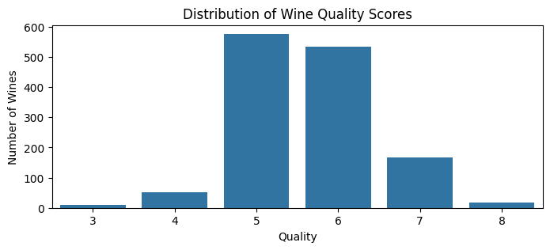
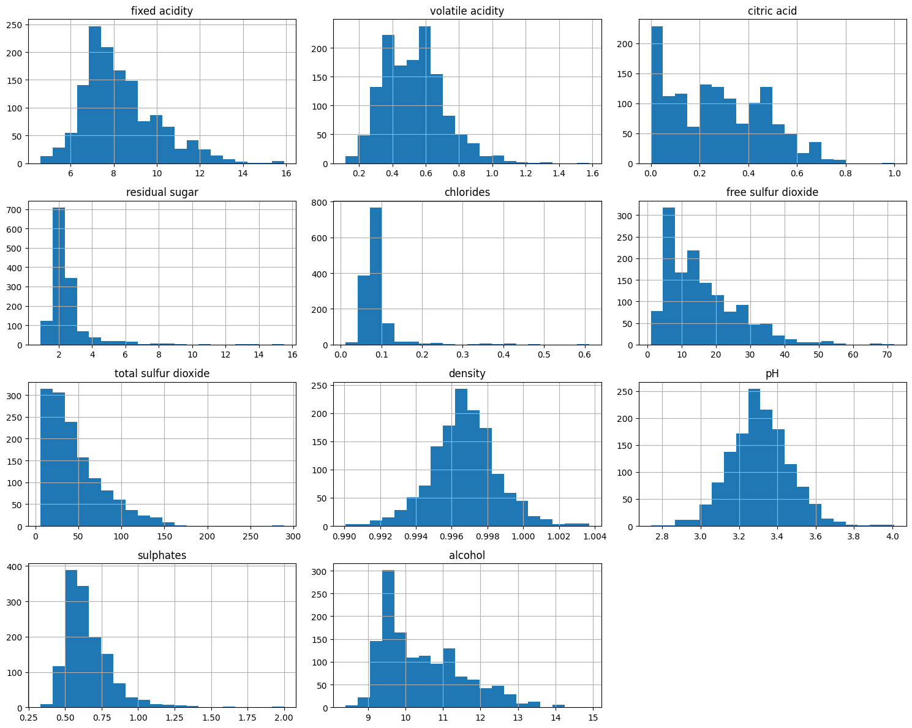
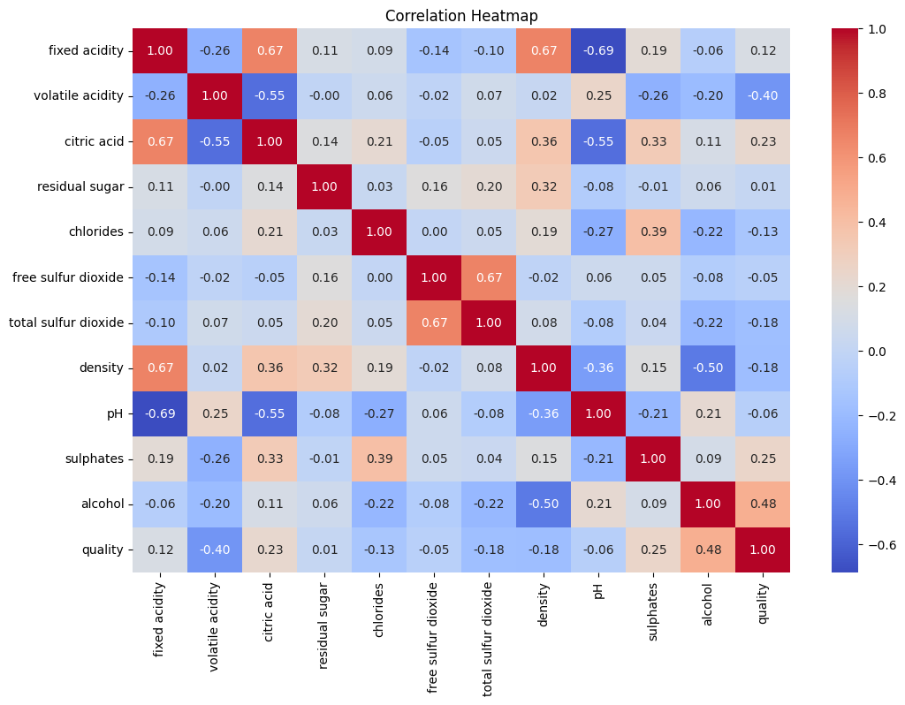
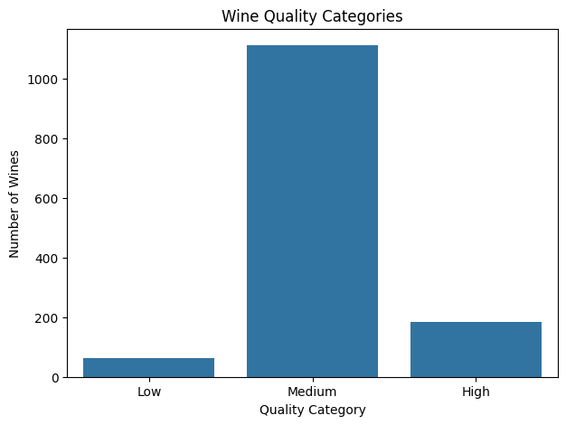
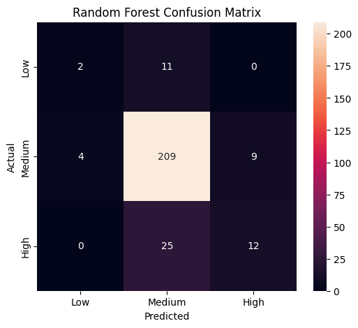
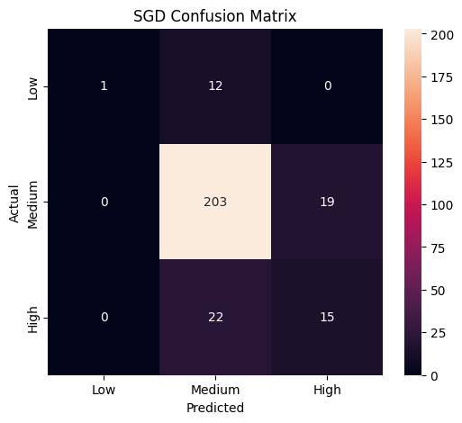
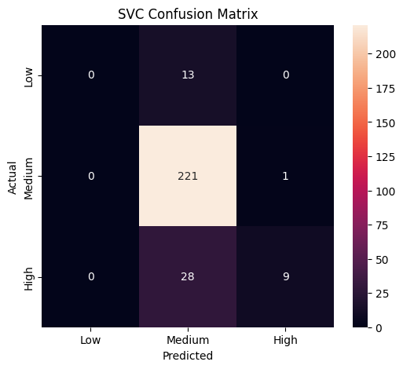
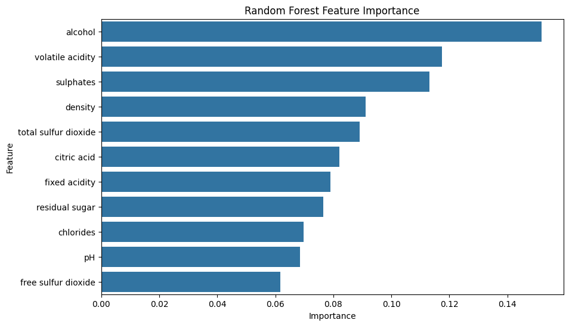

# 🍷 Wine Quality Prediction — Multiclass Classification

This project uses machine learning to guess the quality of red wine — **Low**, **Medium**, or **High** — just by looking at its chemical properties. Three different algorithms are trained and compared: **Random Forest**, **SGD Classifier**, and **Support Vector Classifier (SVC)**.

---

## 📑 Table of Contents

1. [Problem Statement](#-problem-statement)
2. [Solution Overview](#-solution-overview)
3. [Dataset](#-dataset)
4. [Data Quality Issues](#-data-quality-issues)
5. [Exploratory Data Analysis](#-exploratory-data-analysis)
6. [Feature Engineering](#-feature-engineering)
7. [Project Pipeline](#-project-pipeline)
8. [Models Used](#-models-used)
9. [Model Evaluation](#-model-evaluation)
   - [Accuracy Comparison](#accuracy-comparison)
   - [Classification Reports](#classification-reports)
   - [Confusion Matrices](#confusion-matrices)
10. [Feature Importance](#-feature-importance)
11. [Final Results & Model Selection](#-final-results--model-selection)
12. [Project Structure](#-project-structure)
13. [How to Run](#-how-to-run)
14. [Requirements](#-requirements)
15. [Limitations & Future Work](#-limitations--future-work)
16. [Author](#-author)

---

## 🎯 Problem Statement

Normally, wine quality is judged by human tasters. That works, but it's **slow, costly, and depends on personal opinion** — two tasters might disagree on the same wine.

Luckily, every wine in our dataset also has measurable **chemical properties** — things like acidity, sugar, sulfur dioxide, density, pH, and alcohol — along with a **quality score** given by tasters.

So the question we're trying to answer is simple:

> **Can we use the chemical properties of a wine to predict its quality — without needing a human taster?**

This project turns that question into a machine learning problem.

---

## 💡 Solution Overview

The original `quality` column in the dataset has scores from **3 to 8**. But most wines score **5 or 6**, and almost none score **3 or 8**. This is called **class imbalance** — when some categories have a lot of examples and others have very few.

If we tried to train a model to predict all 6 scores directly, it would barely see any examples of quality 3 or 8, and would struggle to learn them properly.

**Our solution:** group the 6 scores into just **3 broader categories**:

| Original Score | New Category |
|---|---|
| 3, 4 | **Low** |
| 5, 6 | **Medium** |
| 7, 8 | **High** |

So the final goal becomes:

> **Build a machine learning system that predicts whether a wine is Low, Medium, or High quality, based on its chemical properties — then train three different models, test how well each one performs, and pick the best one.**

We train and compare **Random Forest**, **SGD Classifier**, and **SVC**, and judge them using **Accuracy, Precision, Recall, F1-score, and Confusion Matrices** — not accuracy alone, because of the class imbalance mentioned above (more on why, later).

---

## 📊 Dataset

**Source file:** `winequality-red.csv` ([UCI Wine Quality Dataset](https://archive.ics.uci.edu/dataset/186/wine+quality) — red wine version)

| Property | Value |
|---|---|
| Rows (raw) | 1,599 |
| Columns | 12 (11 chemical features + 1 quality score) |
| Missing values | 0 |
| Duplicate rows | 240 |
| Rows after cleaning | 1,359 |

**The 11 chemical features, explained simply:**

| # | Feature | What It Means |
|---|---|---|
| 1 | Fixed acidity | Acids that don't evaporate easily — affects sourness/freshness |
| 2 | Volatile acidity | Acidity that can evaporate — too much gives a vinegar-like taste |
| 3 | Citric acid | Gives wine a fresh, citrus-like character |
| 4 | Residual sugar | Sugar left over after fermentation — affects sweetness |
| 5 | Chlorides | Salt-related content in the wine |
| 6 | Free sulfur dioxide | Available SO₂ that protects the wine from oxidation |
| 7 | Total sulfur dioxide | Free SO₂ + bound SO₂ combined |
| 8 | Density | How heavy the wine is for its volume — tied to sugar/alcohol content |
| 9 | pH | How acidic the wine is |
| 10 | Sulphates | Sulfate-related compounds — helps with preservation |
| 11 | Alcohol | Percentage of alcohol by volume — affects strength and body |
| 12 | **Quality** (target) | Score from 3–8 given by tasters, later grouped into Low/Medium/High |

**A few sample rows from the dataset:**

| fixed acidity | volatile acidity | citric acid | residual sugar | chlorides | ... | alcohol | quality |
|---|---|---|---|---|---|---|---|
| 7.4 | 0.70 | 0.00 | 1.9 | 0.076 | ... | 9.4 | 5 |
| 7.8 | 0.88 | 0.00 | 2.6 | 0.098 | ... | 9.8 | 5 |
| 7.8 | 0.76 | 0.04 | 2.3 | 0.092 | ... | 9.8 | 5 |
| 11.2 | 0.28 | 0.56 | 1.9 | 0.075 | ... | 9.8 | 6 |

**Basic statistics after cleaning (`df.describe()`):**

| Stat | fixed acidity | volatile acidity | citric acid | residual sugar | chlorides | free SO₂ | total SO₂ | density | pH | sulphates | alcohol | quality |
|---|---|---|---|---|---|---|---|---|---|---|---|---|
| mean | 8.31 | 0.53 | 0.27 | 2.52 | 0.088 | 15.89 | 46.83 | 0.9967 | 3.31 | 0.66 | 10.43 | 5.62 |
| std | 1.74 | 0.18 | 0.20 | 1.35 | 0.049 | 10.45 | 33.41 | 0.0019 | 0.16 | 0.17 | 1.08 | 0.82 |
| min | 4.60 | 0.12 | 0.00 | 0.90 | 0.012 | 1 | 6 | 0.9901 | 2.74 | 0.33 | 8.40 | 3 |
| max | 15.90 | 1.58 | 1.00 | 15.50 | 0.611 | 72 | 289 | 1.0037 | 4.01 | 2.00 | 14.90 | 8 |

*(`std` here is short for "standard deviation" — a simple measure of how spread out the values are around the average. A small std means most values are close to the mean; a large std means the values vary a lot.)*

---

## ⚠️ Data Quality Issues

Before training any model, we checked the dataset for common problems:

- **Missing values:** None at all — every column was fully filled in (`df.isnull().sum()` showed zero missing values everywhere).
- **Duplicate rows:** We found 240 rows that were exact copies of other rows, so we removed them. This brought the dataset down from 1,599 → **1,359** rows.
- **Class imbalance in `quality`:** Most wines score 5 or 6; very few score 3 or 8:

  | Quality | Approx. Count |
  |---|---|
  | 3 | ~10 |
  | 4 | ~50 |
  | 5 | ~575 |
  | 6 | ~535 |
  | 7 | ~165 |
  | 8 | ~15 |

  This imbalance is exactly why we grouped the scores into **Low / Medium / High**, and why we judge our models using Precision, Recall, and F1-score instead of accuracy alone.
- **Outliers (unusual extreme values):** Some features — residual sugar, chlorides, total SO₂, sulphates — have a small number of wines with unusually high values compared to the rest (see the histograms below). We chose to **keep** these values rather than delete them, because the models we're using can generally handle them reasonably well, and removing more rows would only make the class imbalance worse.

---

## 🔎 Exploratory Data Analysis

*("Exploratory Data Analysis," or EDA, simply means looking closely at the data — through charts and summaries — before building any model, so we understand what we're working with.)*

### Quality Score Distribution



This chart confirms what we already know: most wines score **5 or 6**, and scores of 3 and 8 are rare.

### Feature Distributions



*(A "histogram" is a chart that groups numbers into ranges and shows how many values fall into each range — it helps us see the overall shape of the data.)*

| Feature | Shape | What It Looks Like |
|---|---|---|
| Fixed acidity | Right-skewed | Most values 7–9, with a long tail up to ~16 |
| Volatile acidity | Right-skewed | Most values 0.3–0.7 |
| Citric acid | Skewed, many zeros | A value of zero is very common |
| Residual sugar | Strongly right-skewed | Most values 1–3, a few up to 15+ (likely outliers) |
| Chlorides | Strongly right-skewed | Most values 0.05–0.12, a few up to 0.6 |
| Free SO₂ | Right-skewed | Most values 5–25, tail up to ~70 |
| Total SO₂ | Strongly right-skewed | Most values 0–70, tail up to 250+ |
| Density | Roughly bell-shaped | Concentrated around 0.996–0.998 |
| pH | Roughly normal | Concentrated around 3.2–3.4 |
| Sulphates | Right-skewed | Most values 0.4–0.8 |
| Alcohol | Right-skewed | Most values 9–11%, tail up to 15% |

*("Right-skewed" just means most values are on the lower/smaller side, with a few unusually large values stretching out to the right on a chart.)*

### Correlation Heatmap



*(A "heatmap" uses colors instead of plain numbers, so we can spot strong or weak relationships at a glance instead of reading a big table of numbers.)*

**What "correlation" means:** it's a number between **-1** and **+1** that tells us how strongly two things move together.

- **Close to +1** → when one goes up, the other tends to go up too.
- **Close to -1** → when one goes up, the other tends to go down.
- **Close to 0** → no clear relationship between the two.

**How each feature relates to `quality`:**

| Feature | Correlation w/ Quality | What It Suggests |
|---|---|---|
| **Alcohol** | **+0.48** | Strongest positive link — higher alcohol tends to go with higher quality |
| Sulphates | +0.25 | Weak positive link |
| Citric acid | +0.23 | Weak positive link |
| Fixed acidity | +0.12 | Very weak positive link |
| Residual sugar | +0.01 | Basically no relationship |
| Free sulfur dioxide | -0.05 | Basically no relationship |
| pH | -0.06 | Basically no relationship |
| Chlorides | -0.13 | Very weak negative link |
| Total sulfur dioxide | -0.18 | Weak negative link |
| Density | -0.18 | Weak negative link |
| **Volatile acidity** | **-0.40** | Strongest negative link — higher volatile acidity tends to go with lower quality |

**Some interesting links between features themselves:** fixed acidity ↔ citric acid (+0.67), fixed acidity ↔ pH (-0.69), free SO₂ ↔ total SO₂ (+0.67 — makes sense, since total = free + bound), density ↔ alcohol (-0.50).

> **Important note:** Correlation only measures *straight-line (linear)* relationships. We did **not** remove the weakly-correlated features, because a machine learning model can still find more complex, non-straight-line patterns that a simple correlation number can't capture on its own.

---

## 🛠 Feature Engineering

*("Feature engineering" means preparing or transforming your data to make it more useful for a model — in this case, turning the raw quality scores into simpler categories.)*

We converted the `quality` score into three categories using this logic:

```python
def quality_category(quality):
    if quality <= 4:
        return "Low"
    elif quality <= 6:
        return "Medium"
    else:
        return "High"
```

**How the new categories are distributed:**



| Category | Count | % of Data |
|---|---|---|
| Medium | 1,112 | 81.8% |
| High | 184 | 13.5% |
| Low | 63 | 4.6% |

Even after grouping, **Medium still makes up about 82% of the data**. Keep this in mind — it matters a lot when we look at the results later, because a model can look "accurate" just by guessing Medium most of the time.

---

## 🔄 Project Pipeline

*("Pipeline" just means the step-by-step process the data goes through, from raw file to final prediction.)*

```
Raw CSV (winequality-red.csv, 1599 rows)
        ↓
Data Cleaning (remove 240 duplicate rows → 1359 rows)
        ↓
EDA (histograms, correlation heatmap, class distribution)
        ↓
Feature Engineering (quality → Low / Medium / High)
        ↓
Train/Test Split (80/20, stratified by class)
   → Train: 1087 rows   |   Test: 272 rows
        ↓
Feature Scaling (StandardScaler — fit on train, applied to test)
        ↓
   ┌──────────────┬──────────────┬──────────────┐
   ↓              ↓              ↓
Random Forest   SGD Classifier   SVC
(raw features)  (scaled)         (scaled)
   ↓              ↓              ↓
   └──────────────┴──────────────┘
        ↓
Evaluation (Accuracy, Precision, Recall, F1, Confusion Matrix)
        ↓
Model Comparison & Selection
        ↓
Feature Importance Analysis (Random Forest)
        ↓
Inference on New Data
```

**Splitting the data:** We split the dataset into a **training set** (used to teach the model) and a **test set** (used to check how well it learned, on data it has never seen). We used an 80/20 split, and made sure both sets kept the same proportion of Low/Medium/High wines — this is called a **"stratified" split**.

| Set | Medium | High | Low |
|---|---|---|---|
| Train (n=1087) | 81.9% | 13.5% | 4.6% |
| Test (n=272) | 81.6% | 13.6% | 4.8% |

**Feature scaling:** This means adjusting all the numeric features so they're on a similar scale (instead of, say, alcohol being 8–15 and total SO₂ being 6–289). Random Forest doesn't need this, because it just splits data using simple thresholds, and the scale of the numbers doesn't affect that. But SGD and SVC work by measuring distances and gradients, so they perform much better with scaled data. We used `StandardScaler`, fitting it only on the training data, then applying that same scaling to the test data.

---

## 🤖 Models Used

| Model | Type | Key Idea (in Plain Words) | Scaling Needed? |
|---|---|---|---|
| **Random Forest** | A group ("ensemble") of decision trees | Builds many decision trees, each trained on a random slice of the data and features, then lets them "vote" on the final answer | No |
| **SGD Classifier** | A linear model, trained step-by-step | Repeatedly nudges its internal settings (weights) a little at a time, trying to reduce mistakes, using a method called Stochastic Gradient Descent | Yes |
| **SVC (Support Vector Classifier)** | A boundary-drawing model | Tries to draw the best possible dividing line between classes, using the closest/trickiest data points (called "support vectors") to decide where that line goes | Yes |

**Settings used for each model:**

```python
rf  = RandomForestClassifier(n_estimators=200, random_state=42)
sgd = SGDClassifier(random_state=42, max_iter=1000, tol=1e-3)
svc = SVC(kernel="rbf", random_state=42)
```

*(`random_state=42` just means we fixed the "randomness" so that anyone re-running this code gets the same results every time.)*

---

## 📈 Model Evaluation

### Accuracy Comparison

*("Accuracy" is simply: out of all predictions, how many were correct?)*

| Model | Accuracy |
|---|---|
| Random Forest | 81.99% |
| SGD Classifier | 80.51% |
| **SVC** | **84.56%** |

> ⚠️ **Accuracy alone can be misleading here.** Since Medium wines make up about 82% of the test data, a model could score high just by guessing "Medium" most of the time — even if it's terrible at spotting Low or High wines. This is exactly what happens with SVC below (it never correctly identifies a single Low wine, despite having the best accuracy). That's why we also look at Precision, Recall, and F1-score for each class.

### Classification Reports

Before reading the tables below, here's what each term means in plain English:

- **Precision** — Out of everything the model *labeled* as this class, how much of it was actually correct? Low precision means the model gives a lot of false alarms.
- **Recall** — Out of everything that *truly is* this class, how much did the model actually catch? Low recall means the model misses a lot of real cases.
- **F1-score** — A single score that balances Precision and Recall together. It's especially useful when the classes are imbalanced, like ours.
- **Support** — This is just the number of real (actual) wines of that class in the test set. It's not a performance score — it just tells us how much data that score is based on. A low support number (like Low = 13) means that class's results come from very few examples, so they're less statistically reliable.

**Random Forest**

| Class | Precision | Recall | F1-score | Support |
|---|---|---|---|---|
| High | 0.57 | 0.32 | 0.41 | 37 |
| Low | 0.33 | 0.15 | 0.21 | 13 |
| Medium | 0.85 | 0.94 | 0.90 | 222 |
| **Accuracy** | | | **0.82** | **272** |
| Macro avg | 0.59 | 0.47 | 0.51 | 272 |
| Weighted avg | 0.79 | 0.82 | 0.80 | 272 |

*In simple words:* Random Forest does well on Medium wines (F1 = 0.90), but struggles on Low (F1 = 0.21) and is just okay on High (F1 = 0.41). It catches most Medium wines correctly, but misses most Low and High wines.

**SGD Classifier**

| Class | Precision | Recall | F1-score | Support |
|---|---|---|---|---|
| High | 0.44 | 0.41 | 0.42 | 37 |
| Low | 1.00 | 0.08 | 0.14 | 13 |
| Medium | 0.86 | 0.91 | 0.88 | 222 |
| **Accuracy** | | | **0.81** | **272** |
| Macro avg | 0.77 | 0.47 | 0.48 | 272 |
| Weighted avg | 0.81 | 0.81 | 0.79 | 272 |

*In simple words:* Notice Low's precision is a perfect 1.00, but its recall is only 0.08. This means whenever SGD *does* guess "Low," it's always right — but it barely ever guesses "Low" at all, missing 92% of the actual Low wines. Interestingly, SGD gets the best F1-score for High (0.42) among all three models.

**SVC**

| Class | Precision | Recall | F1-score | Support |
|---|---|---|---|---|
| High | 0.90 | 0.24 | 0.38 | 37 |
| Low | 0.00 | 0.00 | 0.00 | 13 |
| Medium | 0.84 | 1.00 | 0.91 | 222 |
| **Accuracy** | | | **0.85** | **272** |
| Macro avg | 0.58 | 0.41 | 0.43 | 272 |
| Weighted avg | 0.81 | 0.85 | 0.80 | 272 |

*In simple words:* SVC gets the highest accuracy and the best score for Medium (F1 = 0.91, near-perfect recall) — but it **completely fails on Low** (precision, recall, and F1 are all 0.00). It never once correctly identifies a Low wine. This is the clearest example in the whole project of why accuracy alone can't be trusted when classes are imbalanced.

### Confusion Matrices

*(A "confusion matrix" is a simple table that shows exactly where a model gets confused — which classes it mixes up with which. Rows = the real/actual class. Columns = what the model predicted. Numbers on the diagonal = correct guesses. Numbers off the diagonal = mistakes.)*

**Random Forest**



| Actual \ Predicted | Low | Medium | High |
|---|---|---|---|
| **Low** (13) | 2 | 11 | 0 |
| **Medium** (222) | 4 | 209 | 9 |
| **High** (37) | 0 | 25 | 12 |

It correctly identifies 209 out of 222 Medium wines, but only 2 out of 13 Low wines and 12 out of 37 High wines. The biggest mistake pattern: 11 Low wines and 25 High wines were both wrongly labeled as Medium.

**SGD Classifier**



| Actual \ Predicted | Low | Medium | High |
|---|---|---|---|
| **Low** (13) | 1 | 12 | 0 |
| **Medium** (222) | 0 | 203 | 19 |
| **High** (37) | 0 | 22 | 15 |

This is the best of the three models at correctly spotting High wines (15 out of 37), but it still mixes up most Low wines with Medium (12 out of 13).

**SVC**



| Actual \ Predicted | Low | Medium | High |
|---|---|---|---|
| **Low** (13) | 0 | 13 | 0 |
| **Medium** (222) | 0 | 221 | 1 |
| **High** (37) | 0 | 28 | 9 |

It identifies 221 out of 222 Medium wines almost perfectly — but **zero** Low wines correctly. Every single Low wine gets mislabeled as Medium.

**The pattern across all three models:** Low and High wines keep getting mistaken for Medium. This happens because of the class imbalance — since the models see far more Medium examples during training, they all learn that guessing "Medium" is a safe bet whenever they're unsure.

---

## ⭐ Feature Importance

*("Feature importance" tells us which chemical properties the model relied on most when making its decisions.)*

Taken from the trained Random Forest model (`rf.feature_importances_`):



| Rank | Feature | Importance |
|---|---|---|
| 1 | Alcohol | 0.152 |
| 2 | Volatile acidity | 0.117 |
| 3 | Sulphates | 0.113 |
| 4 | Density | 0.091 |
| 5 | Total sulfur dioxide | 0.089 |
| 6 | Citric acid | 0.082 |
| 7 | Fixed acidity | 0.079 |
| 8 | Residual sugar | 0.076 |
| 9 | Chlorides | 0.070 |
| 10 | pH | 0.068 |
| 11 | Free sulfur dioxide | 0.062 |

**Alcohol, volatile acidity, and sulphates** matter the most to the model's decisions — which matches what we saw earlier in the correlation analysis, where alcohol and volatile acidity also had the strongest relationships with quality.

---

## 🏆 Final Results & Model Selection

| Model | Accuracy | Precision (weighted) | Recall (weighted) | F1 Score (weighted) |
|---|---|---|---|---|
| **SVC** | **0.8456** | 0.8109 | 0.8456 | **0.7974** |
| Random Forest | 0.8199 | 0.7899 | 0.8199 | 0.7969 |
| SGD | 0.8051 | 0.8069 | 0.8051 | 0.7862 |

**SVC gets the highest overall accuracy (84.6%) and the highest F1-score**, but that's mostly thanks to its near-perfect performance on Medium wines. Its F1-score is only barely ahead of Random Forest (0.7974 vs 0.7969) — and it completely fails to catch any Low-quality wine.

**So which model should we actually pick?**

- If your goal is simply the **best overall accuracy** on a dataset dominated by Medium wines → **SVC** wins.
- If **correctly spotting rare Low and High wines matters more** — which is often the real point of a wine-quality system, since flagging unusually poor or excellent wine is more useful than confirming an average one → **Random Forest** is the more balanced choice. It's the only model that catches *any* Low wines at all (0.15 recall vs SVC's 0.00), and it also gives us clear, interpretable feature importances.
- **SGD** does reasonably well at catching High wines, but is the weakest overall on both Medium and F1-score.

> In short: there's no single "best" model here — it depends on which class matters most for your use case. Future improvements should focus on getting better at the minority classes (Low, High), not just chasing a higher accuracy number.

---

## 📁 Project Structure

```
wine-quality-prediction/
├── README.md
├── winequality-red.csv                     # Raw dataset
├── wine__main__file.ipynb                  # Main pipeline: EDA → preprocessing → training → evaluation
├── problem_undersatnding.ipynb             # Problem framing & why quality is grouped into 3 classes
├── understaning_dataset.ipynb              # Feature distributions + Random Forest / SVC / SGD deep-dive notes
├── Correlation_Heatmap_Analysis.ipynb      # Correlation heatmap interpretation
├── confusion_matrix_interpretation.ipynb   # Confusion matrix walkthrough for all 3 models
├── feature_s_or__attribute.ipynb           # Feature reference / glossary
├── importan_terms_and_concepts.ipynb       # ML concept notes (histograms, correlation, etc.)
└── assets/                                 # Chart images used in this README
    ├── quality_distribution.png
    ├── feature_histograms.png
    ├── correlation_heatmap.png
    ├── quality_category_distribution.png
    ├── rf_confusion_matrix.png
    ├── sgd_confusion_matrix.png
    ├── svc_confusion_matrix.png
    └── feature_importance.png
```

---

## ▶️ How to Run

1. **Clone the repository**
   ```bash
   git clone <your-repo-url>
   cd wine-quality-prediction
   ```

2. **Create a virtual environment (recommended)**
   ```bash
   python -m venv venv
   source venv/bin/activate      # Windows: venv\Scripts\activate
   ```

3. **Install dependencies**
   ```bash
   pip install -r requirements.txt
   ```

4. **Run the main notebook**
   ```bash
   jupyter notebook wine__main__file.ipynb
   ```
   Run all cells from top to bottom — this loads the data, cleans it, does the EDA, trains all three models, and prints/plots every result shown in this README.

5. **Try predicting on a new wine (example from the notebook):**
   ```python
   new_wine = pd.DataFrame({
       "fixed acidity": [7.5], "volatile acidity": [0.50], "citric acid": [0.30],
       "residual sugar": [2.0], "chlorides": [0.08], "free sulfur dioxide": [15],
       "total sulfur dioxide": [40], "density": [0.996], "pH": [3.30],
       "sulphates": [0.65], "alcohol": [10.5]
   })
   rf.predict(new_wine)   # → 'Medium'
   ```

---

## 📦 Requirements

```
pandas
numpy
matplotlib
seaborn
scikit-learn
jupyter
```

---

## 🚧 Limitations & Future Work

- **Class imbalance** is the biggest challenge in this project — all three models struggle with the Low class, which has only 63 samples in total. Future improvement ideas: try `class_weight="balanced"`, oversampling techniques like SMOTE, or simply gathering more Low/High samples.
- **Hyperparameter tuning** was not done — all three models used default or lightly-set values. Using `GridSearchCV` or `RandomizedSearchCV` to fine-tune the settings could likely improve how well the model detects minority classes.
- We chose to **keep all 11 features** rather than remove weakly-correlated ones, but we didn't try more formal feature-selection methods (like recursive feature elimination) — that's a possible next step.
- **Only 3 algorithms were compared.** Trying gradient boosting methods (like XGBoost or LightGBM), or a properly tuned SVC with `class_weight` set, could be explored next.

---

## 👤 Author

**Akash Kumar**
